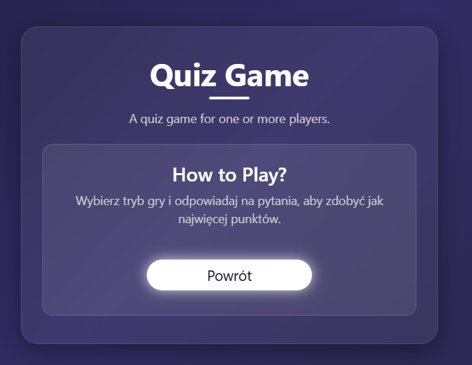

# Aplikacja Quizowa (Spring Boot + HTML/JS)

<p align="center">

</p>

## Wymagania

- Java 17+ 
- Maven  
- Przeglądarka internetowa (np. Chrome)  
- (Opcjonalnie) Postman lub inny klient HTTP

## 🗂️ Struktura projektu (drzewo katalogów)

```
quizApp/
├── data/
│   └── results.json              ← zapisane wyniki graczy
│
├── src/
│   ├── main/
│   │   ├── java/
│   │   │   └── com.inin4.quizApp/
│   │   │       ├── config/       ← konfiguracja Jacksona
│   │   │       │   └── JacksonConfig.java
│   │   │       ├── controller/   ← REST API
│   │   │       │   └── QuizController.java
│   │   │       ├── model/        ← modele danych (DTO + encje)
│   │   │       │   ├── Question.java
│   │   │       │   ├── Result.java
│   │   │       │   ├── AnswerRequest.java
│   │   │       │   └── AnswerResponse.java
│   │   │       ├── service/      ← logika aplikacji
│   │   │       │   ├── QuizService.java
│   │   │       │   └── ResultService.java
│   │   │       └── QuizAppApplication.java   ← klasa startowa Spring Boot
│   │   │
│   │   ├── resources/
│   │   │   ├── static/           ← frontend (HTML + JS + CSS)
│   │   │   │   ├── index.html
│   │   │   │   ├── script.js
│   │   │   │   └── style.css
│   │   │   ├── templates/        ← (nieużywane)
│   │   │   ├── application.properties
│   │   │   └── questions.json    ← plik z pytaniami
│
├── test/                         ← testy jednostkowe
├── pom.xml                       ← plik konfiguracji Mavena
├── README.md                     ← dokumentacja projektu
└── .gitignore / .gitattributes   ← ignorowanie plików tymczasowych
```


## Uruchomienie aplikacji lokalnie

1. **Sklonuj repozytorium lub otwórz projekt w IDE (np. IntelliJ).**

2. **Zbuduj projekt i uruchom aplikację:**

```bash
mvn spring-boot:run
```

3. **Dostęp do frontendowej aplikacji:**

```
http://localhost:8080/index.html
```

## Korzystanie przez przeglądarkę

1. Po wejściu na stronę zobaczysz ekran startowy z wyborem trybu:
   - Single Player
   - Multiplayer (placeholder)
   - How to Play (instrukcja)

2. Wybierz **Single Player**, wpisz imię i rozpocznij quiz.

3. Po zakończeniu:
   - zobaczysz swój wynik,
   - dane zostaną zapisane,
   - pojawi się **ranking wyników**.

## Testowanie przez Postmana

### Sprawdzenie poprawności odpowiedzi

`POST http://localhost:8080/api/quiz/answer`  
Body (JSON):

```json
{
  "questionId": "q1",
  "selectedAnswer": "A"
}
```

### Zapis wyniku

`POST http://localhost:8080/api/quiz/result`  
Body (JSON):

```json
{
  "playerName": "Jan",
  "score": 8,
  "total": 10
}
```

### Odczyt wyników

`GET http://localhost:8080/api/quiz/results`

### Lista wszystkich pytań

`GET http://localhost:8080/api/quiz/all`

## Struktura plików

### Backend:
- `QuizController` — obsługuje wszystkie endpointy quizu i wyników.
- `QuizService` — ładuje pytania z pliku `questions.json`.
- `ResultService` — zapisuje i odczytuje wyniki z `data/results.json`.
- `questions.json` — plik z pytaniami (w `resources/`).
- `results.json` — automatycznie tworzony plik z wynikami (w `/data`).

### Modele:
- `Question` — pojedyncze pytanie z odpowiedziami.
- `Result` — wynik gracza.
- `AnswerRequest` — zapytanie z odpowiedzią gracza.
- `AnswerResponse` — odpowiedź backendu: czy odpowiedź była poprawna.

### Frontend:
- `index.html` — ekran startowy + gra + ranking.
- `style.css` — stylowanie quizu, responsywny layout.
- `script.js` — logika quizu: nawigacja, pytania, wynik, ranking.

## Funkcje aplikacji

- Quiz 1-osobowy (Single Player)
- Zapis wyniku do pliku `.json`
- Dynamiczne pobieranie pytań z pliku
- Wyświetlanie rankingu
- Panel główny z wyborem trybu
- Obsługa dat i punktacji
- UI w języku polskim i/lub angielskim (w zależności od pliku `questions.json`)

## Przykład pytania w `questions.json`

```json
{
  "id": "q3",
  "question": "What is the capital of France?",
  "options": {
    "A": "Berlin",
    "B": "Madrid",
    "C": "Paris"
  },
  "correctAnswer": "C"
}
```

## Na później:

- Możliwość wyboru kategorii quizu
- Tryb multiplayer
- Panel admina do edycji pytań i wyników
