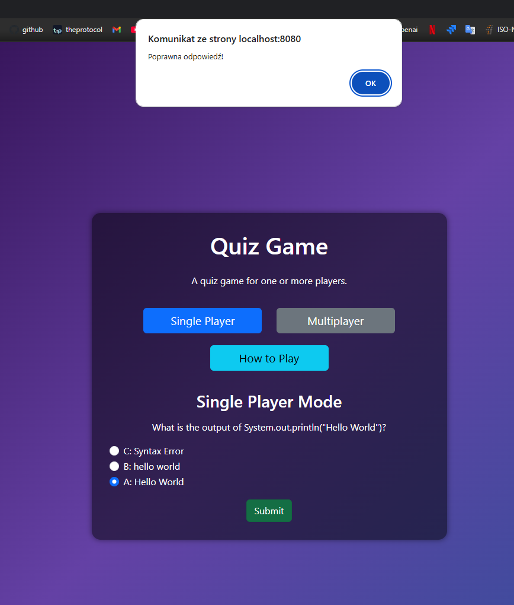

# Quiz App – Backend (Java + Spring Boot)

Na ten moment udostępnia przykładowe pytanie przez REST API.

<p align="center">

</p>

## Struktura projektu

```
quiz-app/
├── src/
│   └── main/
│       ├── java/
│       │   └── com/inin4/quizApp/
│       │       ├── controller/         # Obsługa zapytań HTTP
│       │       │   └── QuizController.java
│       │       ├── model/              # Model danych (Question)
│       │       │   └── Question.java
│       │       └── QuizAppApplication.java  # Punkt startowy aplikacji
│       └── resources/
│           └── application.properties  # Plik konfiguracyjny (obecnie pusty)
├── pom.xml                             # Plik z zależnościami Maven
```

## Jak uruchomić aplikację lokalnie (przez IDE, bez terminala)

### 1. Upewnij się, że masz zainstalowane środowisko IDE

Zalecane użycie:

- IntelliJ IDEA (Community Edition wystarczy)
- lub Eclipse (z wtyczką do Maven i obsługą Spring Boot)

### 2. Pobierz kod projektu

Pobierz projekt z GitHuba:

1. Jeśli masz zainstalowanego Gita: `git clone https://github.com/ININ4/quiz-app.git`
2. Jeśli nie masz Gita:
  - Wejdź na GitHub.
  - Kliknij „Code” > „Download ZIP”.
  - Rozpakuj plik ZIP w dowolnym miejscu.

### 3. Otwórz projekt w IDE

#### IntelliJ IDEA:

1. Otwórz IntelliJ.
2. Wybierz „Open” i wskaż folder `quiz-app`.
3. Poczekaj aż Maven sam zbuduje projekt.
4. Sprawdź, czy plik `QuizAppApplication.java` znajduje się w folderze `src/main/java/com/inin4/quizApp`.

#### Eclipse:

1. Wybierz „File” > „Import”.
2. Wybierz „Maven” > „Existing Maven Projects”.
3. Wskaż folder projektu (`quiz-app`) i załaduj go.

### 4. Uruchom aplikację

1. W drzewie projektu znajdź plik:
   `src/main/java/com/inin4/quizApp/QuizAppApplication.java`
2. Kliknij prawym przyciskiem myszy i wybierz:
   `Run 'QuizAppApplication.main()'`
3. Aplikacja powinna się uruchomić i być dostępna pod adresem:
   `http://localhost:8080`

### 5. Sprawdź działanie

Otwórz przeglądarkę i przejdź do adresu:

```
http://localhost:8080/api/question
```

Jeśli wszystko działa poprawnie, zobaczysz dane JSON z przykładowym pytaniem.

---

## Opcjonalnie: uruchomienie przez terminal

### Wymagania

- Java 17+ oraz Maven zainstalowane globalnie (dostępne w terminalu)

### Krok po kroku:

1. Otwórz terminal (CMD lub PowerShell na Windowsie)
2. Przejdź do katalogu z projektem, np.:

```bash
cd C:\Users\TwojaNazwa\Pulpit\quiz-app
```

lub

```bash
cd ~/Pulpit/quiz-app
```

3. Uruchom aplikację:

```bash
mvn spring-boot:run
```

4. Aplikacja wystartuje pod adresem:

```
http://localhost:8080
```

Wejdź na `http://localhost:8080/api/question` aby sprawdzić działanie.

---

## Dostępne endpointy

### `GET /api/question`

Zwraca przykładowe pytanie w formacie JSON:

```json
{
  "id": "q1",
  "question": "What is the output of System.out.println(\"Hello World\")?",
  "options": {
    "A": "Hello World",
    "B": "hello world",
    "C": "Syntax Error"
  },
  "correctAnswer": "A"
}
```

Uwaga: to tylko przykład. Docelowo pytania będą wczytywane z pliku lub bazy danych, a poprawna odpowiedź nie będzie zwracana do użytkownika.

## Propozycje dalszych kroków

- [ ] Wczytywanie pytań z pliku lub bazy danych
- [ ] Ukrycie poprawnej odpowiedzi w danych wysyłanych do użytkownika
- [ ] Dodanie endpointu `POST` do przesyłania odpowiedzi
- [ ] Ocena odpowiedzi i zwracanie wyniku
- [ ] Zapis wyników do pliku (np. `results.txt`)
- [ ] Walidacja danych i obsługa błędów
